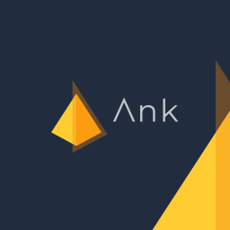
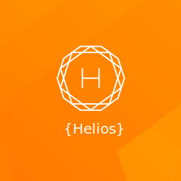
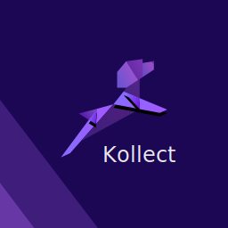

## Started as...

Learning Exercise to learn FP over Slack


---

## ...then KΛTEGORY was born

Solution for Typed FP in Kotlin


---

## Λrrow = KΛTEGORY + Funktionale

We merged with Funktionale to provide a single path to FP in Kotlin


---

## Type classes

Λrrow contains many FP related type classes

|                |                                                      |
|----------------|------------------------------------------------------|
| Error Handling | `ApplicativeError`,`MonadError`                      |
| Computation    | `Functor`, `Applicative`, `Monad`, `Bimonad`, `Comonad`                    |
| Folding        | `Foldable`, `Traverse`                          |
| Combining      | `Semigroup`, `SemigroupK`, `Monoid`, `MonoidK` |
| Effects        | `MonadDefer`, `Async`, `Effect`           |
| Recursion      | `Recursive`, `BiRecursive`,...                                |
| MTL         | `FunctorFilter`, `MonadState`, `MonadReader`, `MonadWriter`, `MonadFilter`, ...                |

---

## Data types

Λrrow contains many data types to cover general use cases.

|                |                                                      |
|----------------|------------------------------------------------------|
| Error Handling | `Option`,`Try`, `Validated`, `Either`, `Ior`         |
| Collections    | `ListKW`, `SequenceKW`, `MapKW`, `SetKW`             |
| RWS            | `Reader`, `Writer`, `State`                          |
| Transformers   | `ReaderT`, `WriterT`, `OptionT`, `StateT`, `EitherT` |
| Evaluation     | `Eval`, `Trampoline`, `Free`, `FunctionN`            |
| Effects        | `IO`, `Free`, `ObservableKW`                         |
| Optics         | `Lens`, `Prism`, `Iso`,...                           |
| Recursion      | `Fix`, `Mu`, `Nu`,...                                |
| Others         | `Coproduct`, `Coreader`, `Const`, ...                |

---

## Requirements: Let's build a simple library

- Fetch Gist information for a given github user name
- Allow easy in memory model updates even when data is deeply nested
  Ex: `gist.user.login`
- Support async non-blocking capable data types such as `Observable`, `Flux`, `Deferred` and `IO`
- Never throw exceptions. All effects should be controlled  
- Provide a pure api in the library public interface

---

## Provide an immutable data model and means to update it

```kotlin
data class Gist(
  val url: String,
  val id: String,
  val files: Map<String, GistFile>,
  val description: String?,
  val comments: Long,
  val owner: GithubUser) 

data class GithubUser(
  val login: String,
  val id: Long,
  val url: String) 

data class GistFile(
  val fileName: String?,
  val type: String,
  val language: String?,
  val size: Long)
```

---

## Provide an immutable data model and means to update it

```kotlin
import arrow.intro.*

val gist = 
  Gist(
    url = "https://api.github.com/gists/4844dffca27c3689b47ea970ed5e276d",
    id = "4844dffca27c3689b47ea970ed5e276d",
    files = mapOf(
      "typeclassless_tagless_extensions.kt" to GistFile(
        fileName = "typeclassless_tagless_extensions.kt",
        type = "text/plain",
        language = "Kotlin",
        size = 1076
      )
    ),
    description = "Tagless with Arrow & typeclassless using extension functions and instances",
    comments = 0,
    owner = GithubUser(
      login = "raulraja",
      id = 456796,
      url = "https://api.github.com/users/raulraja"
    )
  )
```

---

## Provide an immutable data model and means to update it

Simple property updates with the compiler injected synthetic `copy` in all data classes

```kotlin
gist.copy(comments = gist.comments + 1)
// Gist(url=https://api.github.com/gists/4844dffca27c3689b47ea970ed5e276d, id=4844dffca27c3689b47ea970ed5e276d, files={typeclassless_tagless_extensions.kt=GistFile(fileName=typeclassless_tagless_extensions.kt, type=text/plain, language=Kotlin, size=1076)}, description=Tagless with Arrow & typeclassless using extension functions and instances, comments=1, owner=GithubUser(login=raulraja, id=456796, url=https://api.github.com/users/raulraja))
```

---

## Provide an immutable data model and means to update it

As we dive deeper to update nested data the levels of nested `copy` increases

```kotlin
gist.copy(
  owner = gist.owner.copy(
    login = gist.owner.login.toUpperCase()
  )
)
// Gist(url=https://api.github.com/gists/4844dffca27c3689b47ea970ed5e276d, id=4844dffca27c3689b47ea970ed5e276d, files={typeclassless_tagless_extensions.kt=GistFile(fileName=typeclassless_tagless_extensions.kt, type=text/plain, language=Kotlin, size=1076)}, description=Tagless with Arrow & typeclassless using extension functions and instances, comments=0, owner=GithubUser(login=RAULRAJA, id=456796, url=https://api.github.com/users/raulraja))
```

---

## Provide an immutable data model and means to update it

In typed FP this kinds of updates is done with Optics such as `Lens`

```kotlin
import arrow.optics.*

val ownerLens: Lens<Gist, GithubUser> = 
  Lens(
    get = { gist -> gist.owner },
    set = { value -> { gist: Gist -> gist.copy(owner = value) }}
  )
  
val loginLens: Lens<GithubUser, String> = 
  Lens(
    get = { user -> user.login },
    set = { value -> { user -> user.copy(login = value) }}
  )
  
val ownerLogin = ownerLens compose loginLens

ownerLogin.modify(gist, String::toUpperCase)
// Gist(url=https://api.github.com/gists/4844dffca27c3689b47ea970ed5e276d, id=4844dffca27c3689b47ea970ed5e276d, files={typeclassless_tagless_extensions.kt=GistFile(fileName=typeclassless_tagless_extensions.kt, type=text/plain, language=Kotlin, size=1076)}, description=Tagless with Arrow & typeclassless using extension functions and instances, comments=0, owner=GithubUser(login=RAULRAJA, id=456796, url=https://api.github.com/users/raulraja))
```

---

## Provide an immutable data model and means to update it

Updating arbitrarily nested data with Λrrow is a piece of cake

```kotlin
@optics
data class Gist(
  val url: String,
  val id: String,
  val files: Map<String, GistFile>,
  val description: String?,
  val comments: Long,
  val owner: GithubUser
) {
  companion object
}
```

---

## Provide an immutable data model and means to update it

Updating arbitrarily nested data with Λrrow is a piece of cake

```diff
- val ownerLens: Lens<Gist, GithubUser> = 
-  Lens(
-    get = { gist -> gist.owner },
-    set = { value -> { gist: Gist -> gist.copy(owner = value) }}
-  ) 
- val loginLens: Lens<GithubUser, String> = 
-  Lens(
-    get = { user -> user.login },
-    set = { value -> { user -> user.copy(login = value) }}
-  )
- val ownerLogin = ownerLens compose loginLens
- ownerLogin.modify(gist, String::toUpperCase)
+ import arrow.optics.dsl.*
+ Gist.owner.login.modify(gist, String::toUpperCase)
```

---

## Support Async/Non-Blocking Popular data types

A initial naive blocking and exception throwing implementation

```kotlin
import arrow.data.*
import com.squareup.moshi.*
import com.github.kittinunf.fuel.httpGet
import com.github.kittinunf.result.Result

fun publicGistsForUser(userName: String): ListK<Gist> {
  val (_,_, result) = "https://api.github.com/users/$userName/gists".httpGet().responseString()
  return when (result) {
    is Result.Failure -> throw result.getException()
    is Result.Success -> fromJson(result.value)
  }
}

publicGistsForUser("raulraja")
// ListK(list=[Gist(url=https://api.github.com/gists/4844dffca27c3689b47ea970ed5e276d, id=4844dffca27c3689b47ea970ed5e276d, files={typeclassless_tagless_extensions.kt=GistFile(fileName=null, type=text/plain, language=Kotlin, size=1076)}, description=Tagless with Arrow & typeclassless using extension functions and instances, comments=0, owner=GithubUser(login=raulraja, id=456796, url=https://api.github.com/users/raulraja)), Gist(url=https://api.github.com/gists/e5f09c0cbd1392cf4eee5415150ebf76, id=e5f09c0cbd1392cf4eee5415150ebf76, files={dstagless.kt=GistFile(fileName=null, type=text/plain, language=Kotlin, size=3132)}, description=Tagless data source strategies with Arrow, comments=0, owner=GithubUser(login=raulraja, id=456796, url=https://api.github.com/users/raulraja)), Gist(url=https://api.github.com/gists/4b592bbbdd0c048a45ae983c9f66d2eb, id=4b592bbbdd0c048a45ae983c9f66d2eb, files={validation.kt=GistFile(fileName=null, type=text/plain, language=Kotlin, size=2801)}, description=Validation: Accumulating errors and failing fast in Arrow with `ApplicativeError`, comments=0, owner=GithubUser(login=raulraja, id=456796, url=https://api.github.com/users/raulraja)), Gist(url=https://api.github.com/gists/5bd6cc90195508b995d5b834fc315433, id=5bd6cc90195508b995d5b834fc315433, files={Tagless.kt=GistFile(fileName=null, type=text/plain, language=Kotlin, size=1076)}, description=Tagless in Kotlin with Arrow and manual DI, comments=0, owner=GithubUser(login=raulraja, id=456796, url=https://api.github.com/users/raulraja)), Gist(url=https://api.github.com/gists/9267f5c98c92eafe5b2abbf1d22027d8, id=9267f5c98c92eafe5b2abbf1d22027d8, files={gistfile1.txt=GistFile(fileName=null, type=text/plain, language=Text, size=493)}, description=Scala Exercises - LambdaWorld Scala Center Hackathon, comments=0, owner=GithubUser(login=raulraja, id=456796, url=https://api.github.com/users/raulraja)), Gist(url=https://api.github.com/gists/4c52171c35929a1aa0f3ac2762abce87, id=4c52171c35929a1aa0f3ac2762abce87, files={errors.scala=GistFile(fileName=null, type=text/plain, language=Scala, size=3422)}, description=Sane Error Handling, comments=0, owner=GithubUser(login=raulraja, id=456796, url=https://api.github.com/users/raulraja)), Gist(url=https://api.github.com/gists/6b825f53fc5c4370f488b200928cb461, id=6b825f53fc5c4370f488b200928cb461, files={increase_performance_attempt.scala=GistFile(fileName=null, type=text/plain, language=Scala, size=277)}, description=Wrong order of effects, comments=0, owner=GithubUser(login=raulraja, id=456796, url=https://api.github.com/users/raulraja)), Gist(url=https://api.github.com/gists/9cdebac37aaba038235bb5effe0cbd0e, id=9cdebac37aaba038235bb5effe0cbd0e, files={ecpitfalls.scala=GistFile(fileName=null, type=text/plain, language=Scala, size=195)}, description=Wrong Execution Context passed to all ops in the same way via flatMap, comments=0, owner=GithubUser(login=raulraja, id=456796, url=https://api.github.com/users/raulraja)), Gist(url=https://api.github.com/gists/13a8a8789f9b70a1535ea4d44dfb1777, id=13a8a8789f9b70a1535ea4d44dfb1777, files={FreeComposition.hs=GistFile(fileName=null, type=text/plain, language=Haskell, size=2902), FreeComposition.scala=GistFile(fileName=null, type=text/plain, language=Scala, size=3104)}, description=Applications as Coproducts of Free ADTs. http://www.47deg.com/blog/fp-for-the-average-joe-part3-free-monads, comments=1, owner=GithubUser(login=raulraja, id=456796, url=https://api.github.com/users/raulraja)), Gist(url=https://api.github.com/gists/a38b99816020d2bce5fb, id=a38b99816020d2bce5fb, files={KleisliLocalShaped.sc=GistFile(fileName=null, type=application/vnd.ibm.secure-container, language=Scala, size=796)}, description=Shapeless autolifting Kleisli#local to avoid lambda boilerplate, comments=0, owner=GithubUser(login=raulraja, id=456796, url=https://api.github.com/users/raulraja)), Gist(url=https://api.github.com/gists/c9e52f90a10688a4fcb3, id=c9e52f90a10688a4fcb3, files={SearchService.scala=GistFile(fileName=null, type=text/plain, language=Scala, size=2028)}, description=An example of refactoring nested login in the Ensime Search Service with `XorT`, comments=0, owner=GithubUser(login=raulraja, id=456796, url=https://api.github.com/users/raulraja)), Gist(url=https://api.github.com/gists/37a0b88b95113e71f491, id=37a0b88b95113e71f491, files={Either.java=GistFile(fileName=null, type=text/plain, language=Java, size=3578)}, description=A right biased disjoint union in Java with useful functional combinators., comments=0, owner=GithubUser(login=raulraja, id=456796, url=https://api.github.com/users/raulraja)), Gist(url=https://api.github.com/gists/6271058, id=6271058, files={Global.scala=GistFile(fileName=null, type=text/plain, language=Scala, size=641), application.conf=GistFile(fileName=null, type=text/plain, language=null, size=175)}, description=Load application.conf overrides based on runtime environment and merge in overridden props. e.g. application.dev.conf, application.prod.conf, application.test.conf, comments=0, owner=GithubUser(login=raulraja, id=456796, url=https://api.github.com/users/raulraja)), Gist(url=https://api.github.com/gists/4971984, id=4971984, files={ScalaVsJava.md=GistFile(fileName=null, type=text/plain, language=Markdown, size=1105)}, description=Some sample code regarding Scala Vs Java code verbosity, comments=0, owner=GithubUser(login=raulraja, id=456796, url=https://api.github.com/users/raulraja)), Gist(url=https://api.github.com/gists/4543801, id=4543801, files={EmailService.scala=GistFile(fileName=null, type=text/plain, language=Scala, size=6083)}, description=EmailService.scala improved with Exception Handling and Routes, comments=0, owner=GithubUser(login=raulraja, id=456796, url=https://api.github.com/users/raulraja)), Gist(url=https://api.github.com/gists/4521203, id=4521203, files={EmailService.scala=GistFile(fileName=null, type=text/plain, language=Scala, size=982)}, description=scala EmailService Actor, comments=0, owner=GithubUser(login=raulraja, id=456796, url=https://api.github.com/users/raulraja)), Gist(url=https://api.github.com/gists/3931432, id=3931432, files={PersistenceServiceProxy.java=GistFile(fileName=null, type=text/plain, language=Java, size=1490)}, description=Sample Java Proxy, comments=0, owner=GithubUser(login=raulraja, id=456796, url=https://api.github.com/users/raulraja)), Gist(url=https://api.github.com/gists/3930928, id=3930928, files={Application.java=GistFile(fileName=null, type=text/plain, language=Java, size=457)}, description=Sample Java Façade, comments=0, owner=GithubUser(login=raulraja, id=456796, url=https://api.github.com/users/raulraja)), Gist(url=https://api.github.com/gists/3930813, id=3930813, files={Application.java=GistFile(fileName=null, type=text/plain, language=Java, size=939)}, description=Sample Java Abstract Factory, comments=0, owner=GithubUser(login=raulraja, id=456796, url=https://api.github.com/users/raulraja)), Gist(url=https://api.github.com/gists/3928549, id=3928549, files={EarthService.java=GistFile(fileName=null, type=text/plain, language=Java, size=221)}, description=Sample Java Singleton, comments=0, owner=GithubUser(login=raulraja, id=456796, url=https://api.github.com/users/raulraja)), Gist(url=https://api.github.com/gists/1217755, id=1217755, files={NetUtils.java=GistFile(fileName=null, type=text/plain, language=Java, size=1457)}, description=Check if a user has an internet connection for Android, comments=0, owner=GithubUser(login=raulraja, id=456796, url=https://api.github.com/users/raulraja)), Gist(url=https://api.github.com/gists/1176022, id=1176022, files={gistfile1.m=GistFile(fileName=null, type=text/plain, language=Objective-C, size=2741)}, description=Async Operations with ObjectiveC Blocks, comments=0, owner=GithubUser(login=raulraja, id=456796, url=https://api.github.com/users/raulraja)), Gist(url=https://api.github.com/gists/1159583, id=1159583, files={ContextUtils.java=GistFile(fileName=null, type=text/plain, language=Java, size=2150), EventListener.java=GistFile(fileName=null, type=text/plain, language=Java, size=978), EventPublisher.java=GistFile(fileName=null, type=text/plain, language=Java, size=965), EventService.java=GistFile(fileName=null, type=text/plain, language=Java, size=1235), EventServiceImpl.java=GistFile(fileName=null, type=text/plain, language=Java, size=5977), EventSubscriber.java=GistFile(fileName=null, type=text/plain, language=Java, size=1235), SampleAnnotations.java=GistFile(fileName=null, type=text/plain, language=Java, size=803), SampleAnnotationsImpl.java=GistFile(fileName=null, type=text/plain, language=Java, size=1834), SampleProgrammatically.java=GistFile(fileName=null, type=text/plain, language=Java, size=808), SampleProgrammaticallyImpl.java=GistFile(fileName=null, type=text/plain, language=Java, size=1507)}, description=Simple Event Broadcast with JAVA / Spring AOP / Annotations, comments=0, owner=GithubUser(login=raulraja, id=456796, url=https://api.github.com/users/raulraja))])
```

---

## Support Async/Non-Blocking Popular data types

Folks starting with FP in Kotlin lean toward using `Result` and `Either` types.
This is exception free but it remains blocking

```kotlin
import arrow.core.*

fun publicGistsForUser(userName: String): Either<Throwable, ListK<Gist>> {
  val (_,_, result) = "https://api.github.com/users/$userName/gists".httpGet().responseString()
  return when (result) {
    is Result.Failure -> result.getException().left()
    is Result.Success -> fromJson(result.value).right()
  }
}

publicGistsForUser("-__unkown_user__-")
// Left(a=com.github.kittinunf.fuel.core.HttpException: HTTP Exception 404 Not Found)
```

---

## Support Async/Non-Blocking Popular data types

Kotlin Coroutines is a popular async framework

```kotlin
import kotlinx.coroutines.experimental.*

fun publicGistsForUser(userName: String): Deferred<Either<Throwable, ListK<Gist>>> =
  async {
    val (_, _, result) = "https://api.github.com/users/$userName/gists".httpGet().responseString()
    when (result) {
      is Result.Failure -> result.getException().left()
      is Result.Success -> fromJson(result.value).right()
    }
  }

publicGistsForUser("raulraja")
// DeferredCoroutine{Active}@489b9d56
```

---

## A few syntax examples

```kotlin

```

---

## Applicative Builder

```kotlin

```

---

## Applicative Builder

```kotlin
```

---

## Applicative Builder (Same for all data types)

```kotlin
```

---

## Comprehensions - Vanilla

Generalized to all monads. A suspended function provides a non blocking `F<A> -> A`

```kotlin

```

---

## Comprehensions - Exception Aware

Automatically captures exceptions for instances of `MonadError<F, Throwable>`

```kotlin

```

---

## Comprehensions - Filterable

Imperative filtering control for data types that can provide `empty` values.

```kotlin

```

---

## Integrations - Rx2

Let’s take an example and convert it to a comprehension. 

```kotlin
```

---

## Integrations - Rx2

Arrow provides `MonadError<F, Throwable>` for `Observable`

```kotlin
```

---

## Integrations - Kotlin Coroutines 

Arrow provides `MonadError<F, Throwable>` for `Deferred`

```kotlin
```

---

## Transforming immutable data

Λrrow includes an `optics` library that make working with immutable data a breeze

```kotlin
```

---

## Transforming immutable data

Λrrow includes an `optics` library that make working with immutable data a breeze

```kotlin

```

---

## Transforming immutable data

while `kotlin` provides a synthetic `copy` dealing with nested data can be tedious

```kotlin

```

---

## Optics without boilerplate

You may define composable `Lenses` to work with immutable data transformations

```kotlin
```

---

## Optics without boilerplate

You may define composable `Lenses` to work with immutable data transformations

```kotlin

```

---

## Optics without boilerplate

Or just let Λrrow `@optics` do the dirty work

```diff
```

---

## Optics without boilerplate

Optics comes with a succinct and powerful DSL to manipulate deeply nested immutable properties

```kotlin

```

---

## Optics without boilerplate

You can also define `@optics` for your sealed hierarchies

```kotlin
```

---

## Optics without boilerplate

Where you operate over sealed hierarchies manually...

```kotlin

```

---

## Optics without boilerplate

...you cruise now through properties with the new optics DSL

```kotlin

```

---

## In the works

|        |                                                 |
|--------|-------------------------------------------------|
| arrow-generic | Generic programming with products, coproducts and derivation |
| arrow-streams | A functional `Stream<F, A>` impl that abstract over F and complementes `arrow-effect` |
| arrow-android | FP solutions to common Android issues `Ex: Activity lifecycle` |
| bow | Arrow for iOS built on swift |

---

<!-- .slide: class="table-large" -->

## Λrrow is modular

Pick and choose what you'd like to use.

| Module            | Contents                                                              |
|-------------------|-----------------------------------------------------------------------|
| typeclasses       | `Semigroup`, `Monoid`, `Functor`, `Applicative`, `Monad`...                      |
| core/data              | `Option`, `Try`, `Either`, `Validated`...                                     |
| effects           | `IO`                                                                    |
| effects-rx2       | `ObservableKW`, `FlowableKW`, `MaybeK`, `SingleK`                                                          |
| effects-coroutines       | `DeferredK`                                                       |
| mtl               | `MonadReader`, `MonadState`, `MonadFilter`,...                              |
| free              | `Free`, `FreeApplicative`, `Trampoline`, ...                                |
| recursion-schemes | `Fix`, `Mu`, `Nu`                                                                     |
| optics            | `Prism`, `Iso`, `Lens`, ...                                                 |
| meta              | `@higherkind`, `@deriving`, `@instance`, `@optics` |

---

## Kotlin limitations for Typed FP

---

## Kotlin limitations for Typed FP

Emulated Higher Kinds through [Lightweight higher-kinded Polymorphism](https://www.cl.cam.ac.uk/~jdy22/papers/lightweight-higher-kinded-polymorphism.pdf)

---

## Kotlin limitations for Typed FP

Fear not, `@higherkind`'s got your back!

```diff
+ @higherkind sealed class Option<A> : OptionOf<A>
- class ForOption private constructor() { companion object }
- typealias OptionOf<A> = Kind<ForOption, A>
- inline fun <A, B> OptionOf<A>.fix(): Option<A> = this as Option<A>
```

---

## Λrrow ad-hoc polymorphism

With emulated Higher Kinds and Type classes we can now write polymorphic code

```kotlin
import arrow.Kind
import arrow.core.*
import arrow.effects.*
import arrow.typeclasses.*
```

---

## Λrrow ad-hoc polymorphism

With emulated Higher Kinds and Type classes we can now write polymorphic code

```kotlin

```

---

## Λrrow ad-hoc polymorphism

With emulated Higher Kinds and Type classes we can now write polymorphic code

```kotlin
```

---

## Λrrow ad-hoc polymorphism

With emulated Higher Kinds and Type classes we can now write polymorphic code

```kotlin
```

---

## Λrrow ad-hoc polymorphism

With emulated Higher Kinds and Type classes we can now write polymorphic code

```kotlin
```

---

## Λrrow ad-hoc polymorphism

Program that are abstract and work in many runtimes!

```kotlin

```

---

## Λrrow ad-hoc polymorphism

Program that are abstract and work in many runtimes!

```kotlin

```

---

## Λrrow ad-hoc polymorphism

Program that are abstract and work in many runtimes!

```kotlin

```

---

## Type Classes

This is how you define Type Classes in Λrrow (for now)

```kotlin
```

---

## Implementing type class instances is easy...

---

## @deriving

Λrrow can derive instances based on conventions in your data types

```kotlin

```

---

## @instance

Λrrow allows you to hand craft instances

```kotlin
```

---

## KEEP-87

But we are not stopping here, we want to get rid of some of the codegen.

KEEP-87 is A KEEP to introduce Type Classes in Kotlin!

https://github.com/Kotlin/KEEP/pull/87

---

## KEEP-87

Type Classes & Instances

```kotlin
interface Monoid<A> {
  fun A.combine(b: A): A
  val empty: A
}

extension object IntMonoid : Monoid<Int> {
  fun Int.combine(b: Int): Int = this + b
  val empty: Int = 0
}
```

---

## KEEP-87

Declaration site

```kotlin
fun combineOneAndTwo(with mi: Monoid<Int>) =
  1.combine(2) // `Monoid<Int>` is in scope
```

Desugars to

```kotlin
fun combineOneAndTwo(ev: Monoid<Int>) =
  with(ev) { 1.combine(2) } // `this` is ev
```

---

## KEEP-87

Call site

```kotlin
import IntMonoid
combineOneAndTwo() // instance is resolved via imports and injected by the compiler
```

Desugars to

```kotlin
import IntMonoid
combineOneAndTwo(IntMonoid) // compatible with java and allows explicit overrides
```

---

## An ecosystem of libraries

### __Λnk__ 

Markdown documentation, verification and snippet evaluator for Kotlin



---

## An ecosystem of libraries

### __Helios__

A fast, purely functional JSON lib for Kotlin



---

## An ecosystem of libraries

### __Kollect__

Efficient data access with id dedup, parallelization, batching and caching.



---

## Credits

Λrrow is inspired in great libraries that have proven useful to the FP community:

- [Cats](https://typelevel.org/cats/)
- [Scalaz](https://github.com/scalaz/scalaz)
- [Freestyle](http://frees.io)
- [Monocle](http://julien-truffaut.github.io/Monocle/)
- [Funktionale](https://github.com/MarioAriasC/funKTionale)

---

<!-- .slide: class="team" -->

## 72 Contributors and counting

- [ **anstaendig**](https://github.com/anstaendig)
- [ **arturogutierrez**](https://github.com/arturogutierrez)
- [ **ffgiraldez**](https://github.com/ffgiraldez)
- [ **Guardiola31337**](https://github.com/Guardiola31337)
- [ **javipacheco**](https://github.com/javipacheco)
- [  **JMPergar**](https://github.com/JMPergar)
- [ **JorgeCastilloPrz**](https://github.com/JorgeCastilloPrz)
- [ **jrgonzalezg**](https://github.com/jrgonzalezg)
- [ **nomisRev**](https://github.com/nomisRev)
- [ **npatarino**](https://github.com/npatarino)
- [ **pablisco**](https://github.com/pablisco)
- [  **pakoito**](https://github.com/pakoito)
- [ **pedrovgs**](https://github.com/pedrovgs)
- [   **pt2121**](https://github.com/pt2121)
- [ **raulraja**](https://github.com/raulraja)
- [ **wiyarmir**](https://github.com/wiyarmir)
- [ **andyscott**](https://github.com/andyscott)
- [ **Atternatt**](https://github.com/Atternatt)
- [ **calvellido**](https://github.com/calvellido)
- [ **dominv**](https://github.com/dominv)
- [ **GlenKPeterson**](https://github.com/GlenKPeterson)
- [ **israelperezglez**](https://github.com/israelperezglez)
- [ **sanogueralorenzo**](https://github.com/sanogueralorenzo)
- [ **Takhion**](https://github.com/Takhion)
- [ **victorg1991**](https://github.com/victorg1991)
- [ **tonilopezmr**](https://github.com/tonilopezmr)
- [ **NigelHeylen**](https://github.com/NigelHeylen)
- [ **ersin-ertan**](https://github.com/ersin-ertan)


---

<!-- .slide: class="join-us" -->

## Join us!

|        |                                                 |
|--------|-------------------------------------------------|
| Github | https://github.com/arrow-kt/arrow                     |
| Slack  | https://kotlinlang.slack.com/messages/C5UPMM0A0 |
| Gitter | https://gitter.im/arrow-kt/Lobby               |

We provide 1:1 mentoring for both users & new contributors!

---

## Thanks!

Thanks to everyone that makes Λrrow possible

- [](https://www.47deg.com/)
- [](https://kotlinlang.org/)
- [](http://www.lambda.world/)
- [](https://github.com/FineCinnamon)
