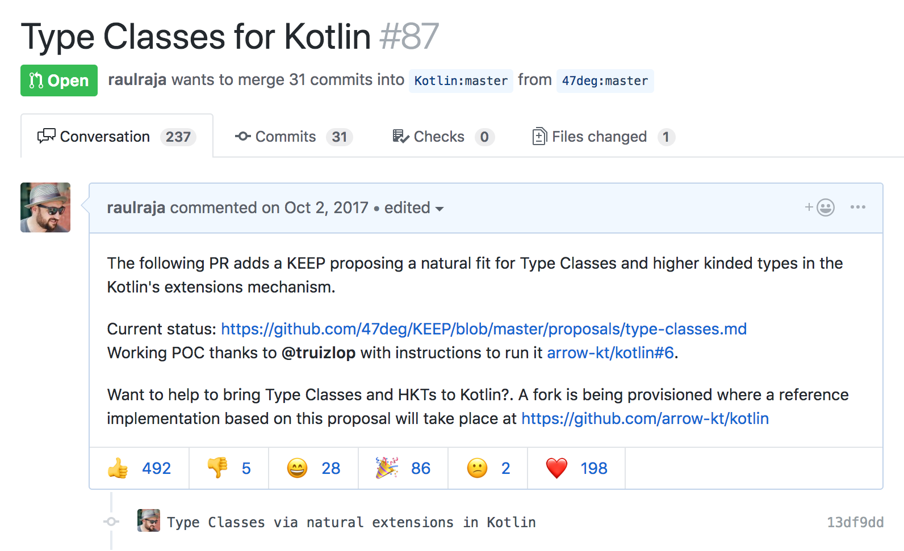
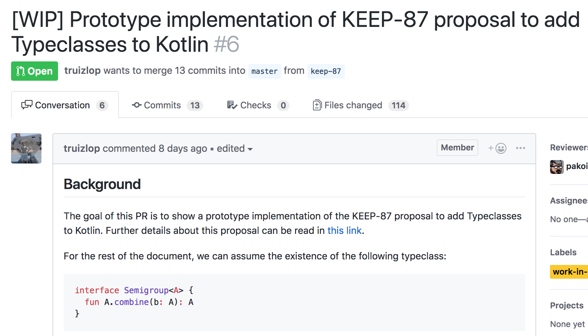
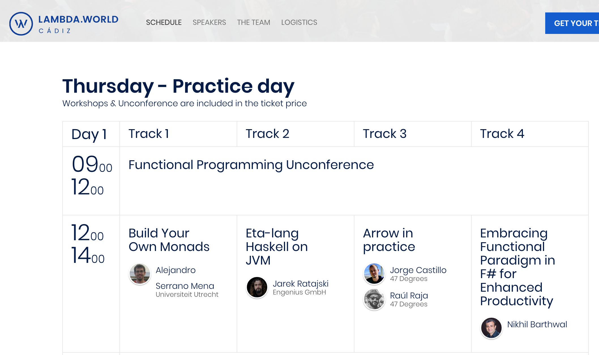

autoscale: true
slidenumbers: true
footer:/           [@raulraja](https://twitter.com/raulraja) -> [@47deg](https://twitter.com/47deg) -> [Sources](https://github.com/47deg/arrow-architecture) -> [Slides](https://speakerdeck.com/raulraja/architecting-typed-fp-applications-and-libraries-in-kotlin-with-lrrow)

# Building Apps & Libraries with Λrrow


---

# Who am I? # 

[@raulraja](https://twitter.com/raulraja)
[@47deg](https://twitter.com/47deg)

- Co-Founder and CTO at 47 Degrees
- Typed FP advocate (regardless of language)

---

## Started as learning Exercise to learn FP in the spanish Android Community Slack


---

## ...then KΛTEGORY was born: Solution for Typed FP in Kotlin


---

## KΛTEGORY + Funktionale = Λrrow


---

## Type classes

Λrrow contains many FP related type classes

|                |                                                      |
|----------------|------------------------------------------------------|
| Error Handling | `ApplicativeError`, `MonadError`                      |
| Computation    | `Functor`, `Applicative`, `Monad`, `Bimonad`, `Comonad`                    |
| Folding        | `Foldable`, `Traverse`                          |
| Combining      | `Semigroup`, `SemigroupK`, `Monoid`, `MonoidK` |
| Effects        | `MonadDefer`, `Async`, `Effect`           |
| Recursion      | `Recursive`, `BiRecursive`,...                                |
| MTL            | `FunctorFilter`, `MonadState`, `MonadReader`, `MonadWriter`, `MonadFilter`, ...                |

---

## Data types

Λrrow contains many data types to cover general use cases.

|                |                                                      |
|----------------|------------------------------------------------------|
| Error Handling | `Option`,`Try`, `Validated`, `Either`, `Ior`         |
| Collections    | `ListK`, `SequenceK`, `MapK`, `SetK`             |
| RWS            | `Reader`, `Writer`, `State`                          |
| Transformers   | `ReaderT`, `WriterT`, `OptionT`, `StateT`, `EitherT` |
| Evaluation     | `Eval`, `Trampoline`, `Free`, `FunctionN`            |
| Effects        | `IO`, `Free`, `ObservableK`                         |
| Optics         | `Lens`, `Prism`, `Iso`,...                           |
| Recursion      | `Fix`, `Mu`, `Nu`,...                                |
| Others         | `Coproduct`, `Coreader`, `Const`, ...                |

---

## Let's build a simple library

### Requirements
1. __Fetch Gists__ information __given a github user__ 
2. __Immutable__ model
  - Allow easy in memory updates
  - Support deeply nested relationships without boilerplate
3. Support __async non-blocking__ data types:
  - `Observable`, `Flux`, `Deferred` and `IO`
  - Allow easy access to nested effects
4. __Pure__:
  - Never throw exceptions
  - Defer effects evaluation

---

## __Fetch Gists__ information __given a github user__ 

^ We are gonna iterate over this function

```kotlin
fun publicGistsForUser(userName: String): List<Gist> = TODO()
```

---

## Immutable model

- Allow easy in memory updates
- Support deeply nested relationships without boilerplate

```kotlin
data class Gist(
  val files: Map<String, GistFile>,
  val description: String?,
  val comments: Long,
  val owner: GithubUser) {
  
  override fun toString(): String =
    "Gist($description, ${owner.login}, file count: ${files.size})"  
    
}

data class GithubUser(val login: String) 

data class GistFile(val fileName: String?)
```

---

## Immutable model

- Allow easy in memory updates
- Support deeply nested relationships without boilerplate

```kotlin
import arrow.intro.*

val gist = 
  Gist(
    files = mapOf(
      "typeclassless_tagless_extensions.kt" to GistFile(
        fileName = "typeclassless_tagless_extensions.kt"
      )
    ),
    description = "Tagless with Λrrow & typeclassless using extension functions and instances",
    comments = 0,
    owner = GithubUser(login = "-__unkown_user1__-")
  )
```

---

## Immutable model

The `data class` synthetic `copy` is fine for simple cases

```kotlin
gist.copy(description = gist.description?.toUpperCase())
// Gist(TAGLESS WITH ΛRROW & TYPECLASSLESS USING EXTENSION FUNCTIONS AND INSTANCES, -__unkown_user1__-, file count: 1)
```

---

## Immutable model

As we dive deeper to update nested data the levels of nested `copy` increases

```kotlin
gist.copy(
  owner = gist.owner.copy(
    login = gist.owner.login.toUpperCase()
  )
)
// Gist(Tagless with Λrrow & typeclassless using extension functions and instances, -__UNKOWN_USER1__-, file count: 1)
```

---

## Immutable model

^ A Lens is a composable function encoding a `getter` and a `setter`.

In Typed FP immutable updates is frequently done with `Optics` like `Lens`

```kotlin
import arrow.optics.*

val ownerLens: Lens<Gist, GithubUser> = 
  Lens(
    get = { gist -> gist.owner },
    set = { value -> { gist: Gist -> gist.copy(owner = value) }}
  )
  
val loginLens: Lens<GithubUser, String> = 
  Lens(
    get = { user -> user.login },
    set = { value -> { user -> user.copy(login = value) }}
  )
  
val ownerLogin = ownerLens compose loginLens

ownerLogin.modify(gist, String::toUpperCase)
// Gist(Tagless with Λrrow & typeclassless using extension functions and instances, -__UNKOWN_USER1__-, file count: 1)
```

---

## Immutable model

Updating arbitrarily nested data with Λrrow is a piece of cake

```kotlin
@optics
data class Gist(
  val url: String,
  val id: String,
  val files: Map<String, GistFile>,
  val description: String?,
  val comments: Long,
  val owner: GithubUser
) {
  companion object
}
```

---

## Provide an immutable data model and means to update it

Updating arbitrarily nested data with Λrrow is a piece of cake

```diff
- val ownerLens: Lens<Gist, GithubUser> = 
-  Lens(
-    get = { gist -> gist.owner },
-    set = { value -> { gist: Gist -> gist.copy(owner = value) }}
-  ) 
- val loginLens: Lens<GithubUser, String> = 
-  Lens(
-    get = { user -> user.login },
-    set = { value -> { user -> user.copy(login = value) }}
-  )
- val ownerLogin = ownerLens compose loginLens
- ownerLogin.modify(gist, String::toUpperCase)
+ import arrow.optics.dsl.*
+ Gist.owner.login.modify(gist, String::toUpperCase)
```

---

## Let's build a simple library

^ We have now an immutable model that can be updated easily regardless of depth

### Requirements
1. __Fetch Gists__ information __given a github user__ 
2. ~~__Immutable__ model~~
  - ~~Allow easy in memory updates~~
  - ~~Support deeply nested relationships without boilerplate~~
3. Support __async non-blocking__ data types:
  - `Observable`, `Flux`, `Deferred` and `IO`
  - Allow easy access to nested effects
4. __Pure__:
  - Never throw exceptions
  - Defer effects evaluation

---

## Support Async/Non-Blocking Popular data types

^ This is impure because throws exceptions and eagerly evaluates effects
^ In typed FP we make emphasis in controlled effect evaluation.

A initial impure implementation that blocks and throws exceptions

```kotlin
import arrow.intro.Gist
import arrow.data.*
import com.squareup.moshi.*
import com.github.kittinunf.fuel.httpGet
import com.github.kittinunf.result.Result

fun publicGistsForUser(userName: String): ListK<Gist> {
  val (_,_, result) = "https://api.github.com/users/$userName/gists".httpGet().responseString() // blocking IO
  return when (result) {
    is Result.Failure -> throw result.getException() // blows the stack
    is Result.Success -> fromJson(result.value)
  }
}
```

---

## Let's build a simple library

^ This fulfills the requirement of fetching gists but remains unsafe

### Requirements
1. ~~__Fetch Gists__ information __given a github user__~~
2. ~~__Immutable__ model~~
  - ~~Allow easy in memory updates~~
  - ~~Support deeply nested relationships without boilerplate~~
3. Support __async non-blocking__ data types:
  - `Observable`, `Flux`, `Deferred` and `IO`
  - Allow easy access to nested effects
4. __Pure__:
  - Never throw exceptions
  - Defer effects evaluation

---

## Don't throw exceptions

^ Most people getting started with FP start with these data types. Try And Either<Throwable, ?> are isomorphic

When learn FP we usually start with exception-free but synchronous `Try` and `Either` like types.

```kotlin
import arrow.core.*

fun publicGistsForUser(userName: String): Either<Throwable, ListK<Gist>> {
  val (_,_, result) = "https://api.github.com/users/$userName/gists".httpGet().responseString() // blocking IO
  return when (result) {
    is Result.Failure -> result.getException().left() //exceptions as a value
    is Result.Success -> fromJson(result.value).right()
  }
}

publicGistsForUser("-__unkown_user__-")
// Left(a=com.github.kittinunf.fuel.core.HttpException: HTTP Exception 404 Not Found)
```

---

## Let's build a simple library

^ We are controlling exceptions now but our remote fetch is blocking

### Requirements
1. ~~__Fetch Gists__ information __given a github user__~~
2. ~~__Immutable__ model~~
  - ~~Allow easy in memory updates~~
  - ~~Support deeply nested relationships without boilerplate~~
3. Support __async non-blocking__ data types:
  - `Observable`, `Flux`, `Deferred` and `IO`
  - Allow easy access to nested effects
4. __Pure__:
  - ~~Never throw exceptions~~
  - Defer effects evaluation

---

## Support Async/Non-Blocking Popular data types

Many choose to go non-blocking with Kotlin Coroutines, a great and popular kotlin async framework

```kotlin
import kotlinx.coroutines.experimental.*

fun publicGistsForUser(userName: String): Deferred<Either<Throwable, ListK<Gist>>> =
  async {
    val (_, _, result) = "https://api.github.com/users/$userName/gists".httpGet().responseString() 
    when (result) {
      is Result.Failure -> result.getException().left()
      is Result.Success -> fromJson(result.value).right()
    }
  }
  
//by default `async` when constructed runs and does not suspend effects  
publicGistsForUser("-__unkown_user1__-") 
// DeferredCoroutine{Active}@514149e1
```

---

## Let's build a simple library

### Requirements
1. ~~__Fetch Gists__ information __given a github user__~~
2. ~~__Immutable__ model~~
  - ~~Allow easy in memory updates~~
  - ~~Support deeply nested relationships without boilerplate~~
3. Support __async non-blocking__ data types:
  - `Observable`, `Flux`, ~~Deferred~~ and `IO`
  - Allow easy access to nested effects
4. __Pure__:
  - ~~Never throw exceptions~~
  - Defer effects evaluation

---

## Support Async/Non-Blocking Popular data types

^ Composition is hard because there are nested effects, async effect and either effect

But now we have to dive deep into the `Deferred` and `Either` effects to get to the value we care about

```kotlin
suspend fun allGists(): List<Gist> {
  val result1: Either<Throwable, ListK<Gist>> = publicGistsForUser("-__unkown_user1__-").await() 
  val result2: Either<Throwable, ListK<Gist>> = publicGistsForUser("-__unkown_user2__-").await()
  return when {
    result1 is Either.Right && result2 is Either.Right ->
      result1.b + result2.b
    else ->
      emptyList<Gist>()
  }
}
```

---

## Support Async/Non-Blocking Popular data types

^ We can flatMap through both async and either effects with monad transformers, but in most cases transformers are not even necessary.
^ Λrrow's binding is a for comprehension in delegates under the covers to flatMap using suspension with coroutines.

Λrrow Monad Transformers help with syntax in the world of nested effects.

```kotlin
import arrow.effects.*
import arrow.instances.*
import arrow.typeclasses.*
import arrow.effects.typeclasses.*

fun allGists(): DeferredK<Either<Throwable, List<Gist>>> = 
  EitherT
    .monad<ForDeferredK, Throwable>(DeferredK.monad())
    .binding {
       val result1 = EitherT(publicGistsForUser("-__unkown_user1__-").k()).bind()
       val result2 = EitherT(publicGistsForUser("-__unkown_user2__-").k()).bind()
       result1 + result2
   }.value().fix()

// Λrrow's delegation to `async` is always lazy
allGists()
// DeferredK(deferred=LazyDeferredCoroutine{New}@5113d1f2)
```

---

## Let's build a simple library

^ We are still unable to support other frameworks because our impl depends on coroutines

### Requirements
1. ~~__Fetch Gists__ information __given a github user__~~
2. ~~__Immutable__ model~~
  - ~~Allow easy in memory updates~~
  - ~~Support deeply nested relationships without boilerplate~~
3. Support __async non-blocking__ data types:
  - `Observable`, `Flux`, ~~Deferred~~ and `IO` <- What about all other data types?
  - ~~Allow easy access to nested effects~~
4. ~~__Pure__:~~
  - ~~Never throw exceptions~~
  - ~~Defer effects evaluation~~

---

## Support Async/Non-Blocking Popular data types

^ You can make your implementation depend on the actual abstractions behind the frameworks
^ Write your program once and run it to multiple frameworks

Turns out we don't need concrete data types if we use Type classes and Polymorphism

---

## Support Async/Non-Blocking Popular data types

Λrrow can abstract away the computational container type emulating __higher kinded types__.

`Kind<F, A>` denotes an `A` value inside an `F` type contructor:
Ex: `List<A>`, `Deferred<A>`, `IO<A>`, `Observable<A>`

```kotlin
import arrow.Kind

interface GistApiDataSource<F> {
  fun publicGistsForUser(userName: String): Kind<F, ListK<Gist>>
}
```

---

## Support Async/Non-Blocking Popular data types

Emulating __higher kinded types__ is based on `defunctionalization`
[__Lightweight higher-kinded polymorphism__](https://www.cl.cam.ac.uk/~jdy22/papers/lightweight-higher-kinded-polymorphism.pdf) 
by Jeremy Yallop and Leo White

```diff
+ @higherkind
+ class Option<A> : OptionOf<A>
- class ForOption private constructor() { companion object }
- typealias OptionOf<A> = arrow.Kind<ForOption, A>
- inline fun <A> OptionOf<A>.fix(): Option<A> =
-   this as Option<A>
```

---

## Support Async/Non-Blocking Popular data types

How can we implement a computation in the context of `F` if we don't know what `F` is?

```kotlin
class DefaultGistApiDataSource<F> : GistApiDataSource<F> {
  override fun publicGistsForUser(userName: String): Kind<F, ListK<Gist>> = TODO()
}
```

---

## Support Async/Non-Blocking Popular data types

Ad-Hoc Polymorphism and type classes!

A type class is a generic interface that describes behaviors that concrete types can support

```kotlin
interface Functor<F> {
  // Λrrow projects type class behaviors as static or extension functions over kinded values
  fun <A, B> Kind<F, A>.map(f: (A) -> B): Kind<F, B>
  fun <A, B> lift(f: (A) -> B): (Kind<F, A>) -> Kind<F, B> =
      { fa: Kind<F, A> -> fa.map(f) }
}
```

---

## Support Async/Non-Blocking Popular data types

Ad-Hoc Polymorphism and type classes!

A data type may be able to implement such abstract interfaces

```kotlin
@extension interface DeferredFunctor : Functor<ForDeferredK> {
  override fun <A, B> Kind<ForDeferredK, A>.map(f: (A) -> B): DeferredK<B> =
    fix().map(f)
}
```

---

## Support Async/Non-Blocking Popular data types

Ad-Hoc Polymorphism and type classes!

A data type may be able to implement such abstract interfaces

```kotlin
@extension interface IOFunctor : Functor<ForIO> {
  override fun <A, B> Kind<ForIO, A>.map(f: (A) -> B): IO<B> =
    fix().map(f)
}
```

---

## Support Async/Non-Blocking Popular data types

Ex. `Functor` allows us to transform the contents regardless of the concrete data type.

```kotlin
listOf(1).map { it + 1 }
// [2]
```
```kotlin
Option(1).map { it + 1 }
// Some(2)
```
```kotlin
Try { 1 }.map { it + 1 }
// Success(value=2)
```
```kotlin
Either.Right(1).map { it + 1 }
// Right(b=2)
```

---

## Support Async/Non-Blocking Popular data types

### Λrrow includes a comprehensive list of type classes

| Type class | Combinator |
| --- | --- |
| Semigroup | combine | 
| Monoid | empty | 
| Functor | map, lift | 
| Foldable | foldLeft, foldRight | 
| Traverse | traverse, sequence | 
| Applicative | just, ap | 
| ApplicativeError | raiseError, catch | 
| Monad | flatMap, flatten | 
| MonadError | ensure, rethrow | 
| MonadDefer | delay, suspend | 
| Async | async | 
| Effect | runAsync | 

---

### Λrrow includes a comprehensive list of type classes

Data types may support all or a subset of type classes based on capabilities:

| Type class | Combinators | **List** |
| --- | --- | --- |
| Functor | map, lift | ✓ |
| Applicative | just, ap | ✓ | 
| ApplicativeError | raiseError, catch | ✕ |
| Monad | flatMap, flatten | ✓ |
| MonadError | ensure, rethrow | ✕ |
| MonadDefer | delay, suspend | ✕ |
| Async | async | ✕ |
| Effect | runAsync | ✕ |

---

### Λrrow includes a comprehensive list of type classes

Data types may support all or a subset of type classes based on capabilities:

| Type class | Combinators | **List** | **Either** | **Deferred** | **IO** |
| --- | --- | --- | --- | --- | --- |
| Functor | map, lift | ✓ | ✓ | ✓ | ✓ | 
| Applicative | pure, ap | ✓ | ✓ | ✓ | ✓ | 
| ApplicativeError | raiseError, catch | ✕ | ✓ | ✓ | ✓ | 
| Monad | flatMap, flatten | ✓ | ✓ | ✓ | ✓ | 
| MonadError | ensure, rethrow | ✕ | ✓ | ✓ | ✓ | 
| MonadDefer | delay, suspend | ✕ | ✕ | ✓ | ✓ | 
| Async | async | ✕ | ✕ | ✓ | ✓ | 
| Effect | runAsync | ✕ | ✕ | ✓ | ✓ | 

---

## Support Async/Non-Blocking Popular data types

We can use the `Async` type class to lift async computations into the abstract context of `F`

```kotlin
class DefaultGistApiDataSource<F>(private val async: Async<F>) : GistApiDataSource<F>, Async<F> by async {
  override fun publicGistsForUser(userName: String): Kind<F, ListK<Gist>> =
    async { proc: (Either<Throwable, ListK<Gist>>) -> Unit ->
      "https://api.github.com/users/$userName/gists".httpGet().responseString { _, _, result ->
        when (result) {
          is Result.Failure -> proc(result.getException().left())
          is Result.Success -> proc(fromJson(result.value).right())
         }
      }
    }
}
```

---

## Support Async/Non-Blocking Popular data types

If we have more than one logical services we can group them into a module

```kotlin
abstract class Module<F>(
  val async: Async<F>,
  val logger: Logger<F> = DefaultConsoleLogger(async),
  private val dataSource: GistApiDataSource<F> = DefaultGistApiDataSource(async, logger),
  val api: GistsApi<F> = DefaultGistApi(dataSource)
)
```

---

## Support Async/Non-Blocking Popular data types

Our library now supports all data types that provide a type class instance for `Async`.
This pattern allow you to keep code in a single place while providing

```groovy
compile "com.biz:mylib-coroutines:$version"
```
```kotlin
object KotlinCoroutinesRuntime : Module<ForDeferredK>(DeferredK.async())
```
```kotlin
import arrow.intro.runtime.*
KotlinCoroutinesRuntime.api.publicGistsForUser("-__unkown_user1__-")
// DeferredK(deferred=LazyDeferredCoroutine{New}@2e2d965)
```

---

## Support Async/Non-Blocking Popular data types

Our library now supports all data types that provide a type class instance for `Async`.
This pattern allow you to keep code in a single place while providing

```groovy
compile "com.biz:mylib-reactor:$version"
```
```kotlin
object ReactorRuntime : Module<ForFluxK>(FluxK.async())
```
```kotlin
import arrow.intro.runtime.*
ReactorRuntime.api.publicGistsForUser("-__unkown_user1__-")
// FluxK(flux=FluxFlatMap)
```

---

## Support Async/Non-Blocking Popular data types

Our library now supports all data types that provide a type class instance for `Async`.
This pattern allow you to keep code in a single place while providing

```groovy
compile "com.biz:mylib-arrow-io:$version"
```
```kotlin
object IORuntime : Module<ForIO>(IO.async())
```
```kotlin
import arrow.intro.runtime.*
IORuntime.api.publicGistsForUser("-__unkown_user1__-")
// Bind(cont=Suspend(thunk=() -> arrow.effects.IO.Pure<A>), g=(A) -> arrow.effects.IO<B>)
```

---

## Support Async/Non-Blocking Popular data types

Our library now supports all data types that provide a type class instance for `Async`.
This pattern allow you to keep code in a single place while providing

```groovy
compile "com.biz:mylib-rx2:$version"
```
```kotlin
object Rx2Runtime : Module<ForObservableK>(ObservableK.async())
```
```kotlin
import arrow.intro.runtime.Rx2Runtime
Rx2Runtime.api.publicGistsForUser("-__unkown_user1__-")
// ObservableK(observable=io.reactivex.internal.operators.observable.ObservableFlatMap@fb152c5)
```

---

## Let's build a simple library

### Requirements
1. ~~__Fetch Gists__ information __given a github user__~~
2. ~~__Immutable__ model~~
  - ~~Allow easy in memory updates~~
  - ~~Support deeply nested relationships without boilerplate~~
3. ~~Support __async non-blocking__ data types:~~
  - ~~Observable, Flux, Deferred and IO~~
  - ~~Allow easy access to nested effects~~
4. ~~__Pure__:~~
  - ~~Never throw exceptions~~
  - ~~Defer effects evaluation~~

---

## Recap

### Requirements
1. FUNC REQ ~~__Fetch Gists__ information __given a github user__~~
2. OPTICS ~~__Immutable__ model~~
  - ~~Allow easy in memory updates~~
  - ~~Support deeply nested relationships without boilerplate~~
3. POLYMORPHISM ~~Support __async non-blocking__ data types:~~
  - ~~Observable, Flux, Deferred and IO~~
  - ~~Allow easy access to nested effects~~
4. EFFECT CONTROL ~~__Pure__:~~
  - ~~Never throw exceptions~~
  - ~~Defer effects evaluation~~

---

## Λrrow is modular

Pick and choose what you'd like to use.

| Module            | Contents                                                              |
|-------------------|-----------------------------------------------------------------------|
| typeclasses       | `Semigroup`, `Monoid`, `Functor`, `Applicative`, `Monad`...                      |
| core/data         | `Option`, `Try`, `Either`, `Validated`...                                     |
| effects           | `Async`, `MonadDefer`, `Effect`, `IO`...                                                                    |
| effects-rx2       | `ObservableK`, `FlowableK`, `MaybeK`, `SingleK`                                                          |
| effects-coroutines       | `DeferredK`                                                       |
| mtl               | `MonadReader`, `MonadState`, `MonadFilter`,...                              |
| free              | `Free`, `FreeApplicative`, `Trampoline`, ...                                |
| recursion-schemes | `Fix`, `Mu`, `Nu`                                                                     |
| optics            | `Prism`, `Iso`, `Lens`, ...                                                 |
| meta              | `@higherkind`, `@deriving`, `@extension`, `@optics` |

---

## We want to make Typed FP in Kotlin even easier



---

## Thanks to [@tomasruizlopez](https://twitter.com/tomasruizlopez) we have a POC for KEEP-87: 

### [https://github.com/arrow-kt/kotlin/pull/6](https://github.com/arrow-kt/kotlin/pull/6)



---

## KEEP-87 Proposes the following changes to Kotlin

Type class declarations are simple plain interfaces and have a expanded usage beyond FP

```kotlin
interface Repository<A> {
  fun A.save(): A
  fun cache(): List<A>
}
```

---

## KEEP-87 Proposes the following changes to Kotlin

Multiple data types can implement the behavior without resorting to inheritance

```kotlin
extension object UserRepository : Repository<User> {
  fun User.save(): User = TODO()
  fun cache(): List<User> = TODO()
}
```

---

## KEEP-87 Proposes the following changes to Kotlin

We can write polymorphic code with compile time verified dependencies

```kotlin
fun <A> persistCache(with R: Repository<A>): List<A> =
  cache().map { it.save() }
  
persistCache<User>() // compiles and runs because there is a [Repository<User>]
persistCache<Invoice>() // fails to compile: No `extension` [Repository<Invoice>] found
persistCache(UserRepository) // java compatible
persistCache(InvoiceRepository) // compiles and runs because extension context is provided explicitly
```

---

## KEEP-87 

The Λrrow team plans to submit this proposal once it's solid and it has properly addressed feedback
from the community and the jetbrains compiler team.

---

## Credits

Λrrow is inspired in great libraries that have proven useful to the FP community:

- [Cats](https://typelevel.org/cats/)
- [Scalaz](https://github.com/scalaz/scalaz)
- [Freestyle](http://frees.io)
- [Monocle](http://julien-truffaut.github.io/Monocle/)
- [Funktionale](https://github.com/MarioAriasC/funKTionale)

---

## Join us!

|        |                                                 |
|--------|-------------------------------------------------|
| Github | https://github.com/arrow-kt/arrow                     |
| Slack  | https://kotlinlang.slack.com/messages/C5UPMM0A0 |
| Gitter | https://gitter.im/arrow-kt/Lobby               |

We are beginner friendly and provide 1:1 mentoring for both users & new contributors!
+90 Contributors and growing!

---

## Join us at [lambda.world](http://cadiz.lambda.world/schedule/#session-103) for more FP in Kotlin!



---

## Thanks!

### Thanks to everyone that makes Λrrow possible!

